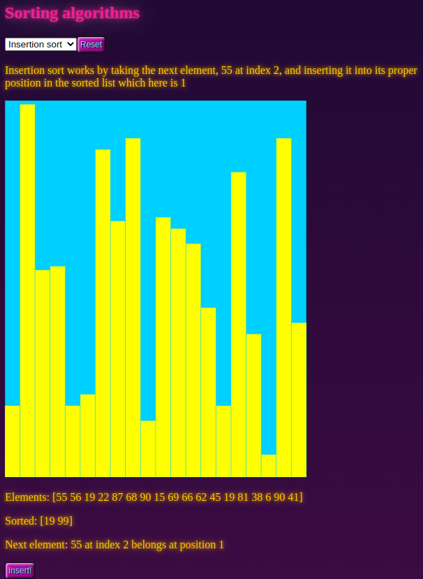

# porkostomus/sort



## Inspiration

For a job interview take-home test I was asked to implement [Dijkstra's algorithm](https://github.com/porkostomus/dijkstra-cljs). "Haha, cool," I thought, but then realized that I had a problem.

Like any good Clojurist, I had *already seen* that one solved plenty of ways, so the challenge therefore became how to make it look like I hadn't seen the answer and instead find a way to explore the problem in my own way.

I never actually completed the assignment. But it got me thinking.

Most algorithms in Clojure are written very elegantly, often in a functional style which is very clever but can sometimes obscure the essence of what it is doing. Following this practice is very beneficial for just about every reason, *except* for gaining intuition about the algorithm! And after all, why else would I be implementing a classic algorithm in Clojure if not to showcase the way it works? So, I found that by modeling the algorithm *statefully* (yes, the opposite of what we normally try to do), it allowed me to focus on a single iteration at a time, visualizing each step without getting confused by the outer looping machinery or reducing operation. How about that?

For example, here is the essence of selection sort:

``` clojure
(fn []
  (swap! sorted conj val)
  (swap! elements #(remove-nth % idx)))
```

Much like our reactive frontend libraries have us model our app state using a central data store and compute the views from this data, we store our data to be operated on in a global atom and then write functions that derive the necessary facts from it to compute the next step. I find this highly refreshing.

The visualization was inspired by the animation on the [Insertion sort Wikipedia page](https://en.wikipedia.org/wiki/Insertion_sort). I plan on going through the rest of [The Algorithm Design Manual](https://www.algorist.com/) and making similar toys to prove that I understand them.

### Development mode
```
npm install
npx shadow-cljs watch app
```
start a ClojureScript REPL
```
npx shadow-cljs browser-repl
```
### Building for production

```
npx shadow-cljs release app
```
